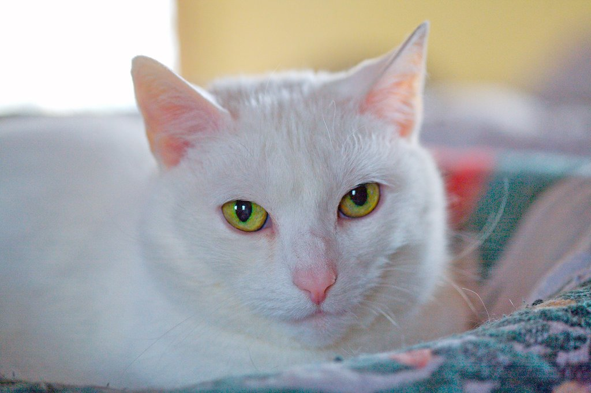

# Building a neural network for binary classification from scratch

This repository consists of 2 parts: 
- `\building` for building our neural networks (one will be a 2-layer network, while the other will be L-layer network)
-  `\running` for testing our neural networks on binary classification for cat and non-cat images.

Detailed explanation and visuals for almost every code cell are provided in both files, feel free to check them out!

## General Overview:

### Task: 
To classifiy cat and non-cat images. 
  

### We'll be using ReLU activation function for hidden layers and Sigmoid activation function for output layer. The overall network will look something like this:

### Inner workings of 2-layer network:

Get input -> Initizalize parameters -> Pass through ReLU in hidden layer -> Pass through Sigmoid in output layer -> Compute Loss -> Backward Propogation to minimize loss (gradient descent) -> Update parameters

### Inner workings of L-layer network:

Same as 2-Layer network but we repeat the hidden-layer process (L-1) times. This allows for a "deeper" network to be built and more patterns/relationships to be extracted from the input. At the output layer, we use the same Sigmoid function.

 

 This project has been built under the first course "Neural Networks and Deep Learning" in the Coursera Deep Learning Specialization, offered by [DeepLearning.AI](https://www.deeplearning.ai/) and taught by Andrew Ng himself. 
